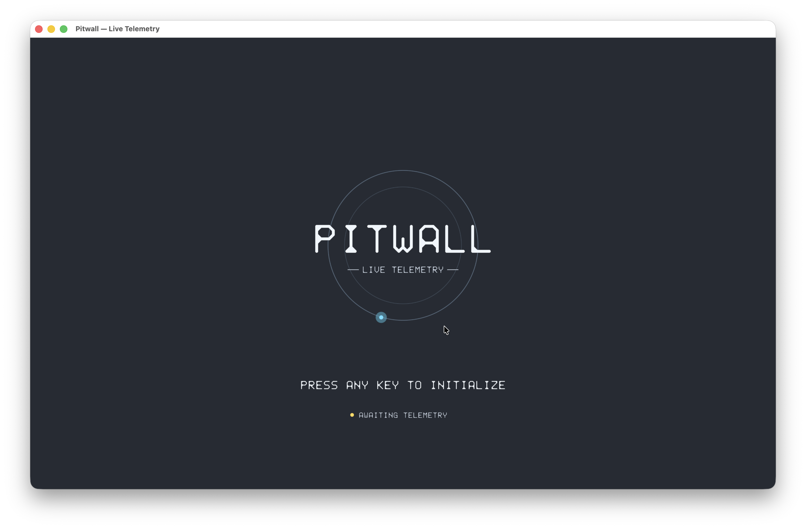
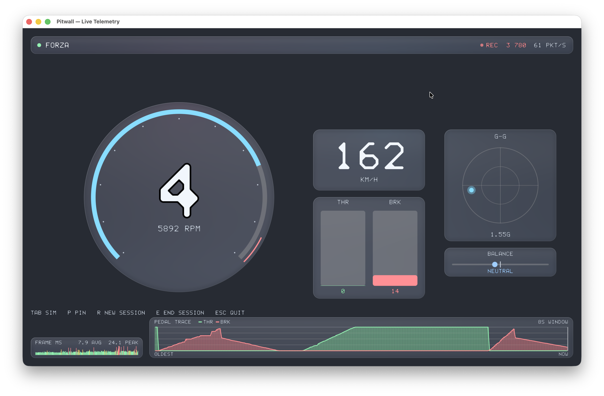
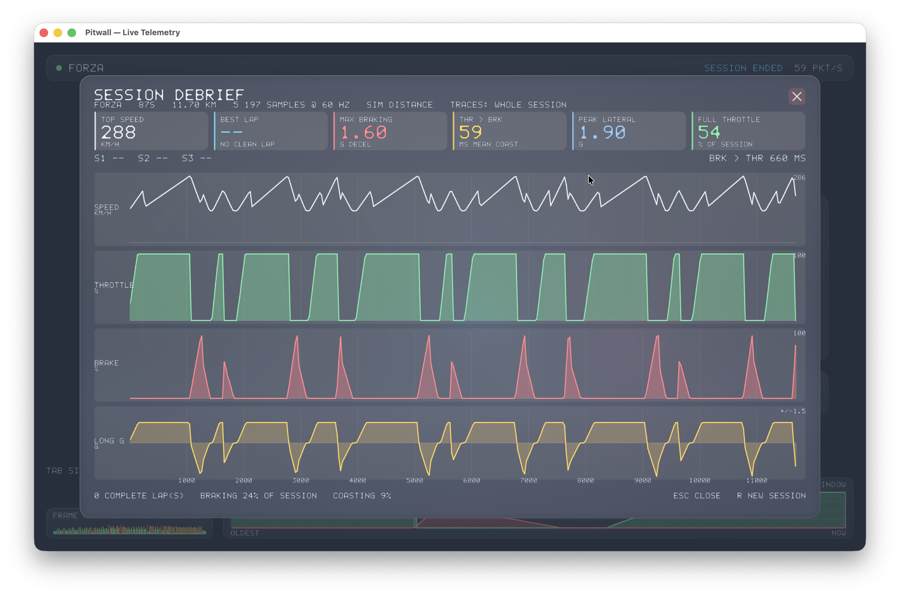

# Pitwall

Live racing telemetry, session recording and setup analysis for **Forza**,
**F1 25**, and **Assetto Corsa**. Rust, GPU-rendered, no garbage collector
anywhere in the frame path.

 

```
crates/telemetry-core       UDP ingest, protocol decoders, lock-free transport,
                            session logging, capture/replay
crates/telemetry-analysis   heuristic vehicle dynamics engine: corner segmentation,
                            driver fingerprint, gearing, session debrief, setup analyzer
crates/pitwall              the application: wgpu renderer, audio, CLI
tools/fake_sim.py           synthetic packet source, all three protocols
legacy/                     the original C and Python prototypes (engine.c bug fixed)
```

## Quick start

You don't need a simulator to see it run.

```sh
# terminal 1 — synthetic telemetry
python3 tools/fake_sim.py --sim forza

# terminal 2 — the cluster
cargo run --release -p pitwall
```

`--sim f1` and `--sim ac` speak the other two protocols. The app auto-detects
which; you never tell it.

 

## Against a real sim

| Sim | Configure it to send to | Notes |
|---|---|---|
| Forza Horizon 4/5, Motorsport | this machine's IP, port 5000, "Data Out" = ON, format **Dash** | |
| F1 25 | Settings → Telemetry, UDP on, port 5000, rate **60 Hz** | |
| Assetto Corsa | — | Pass `--ac-server <sim-ip>:9996`; AC is request/response and must be asked |

```sh
cargo run --release -p pitwall -- --port 5000
cargo run --release -p pitwall -- --ac-server 192.168.1.20:9996
```

**ACC is different.** Its UDP feed carries session and timing data, not
physics. The real ACC channel is shared memory, readable only on the machine
running the sim, so a remote rig needs a small forwarder. See
[docs/ARCHITECTURE.md](docs/ARCHITECTURE.md).

## The data pipeline

Two stages, on two threads, connected by lock-free structures. The render
thread never waits for either of them.

```
UDP socket
   │  telemetry-ingest thread        recv → stamp → raw capture → decode
   ├──► TripleBuffer<TelemetrySample>   latest-wins  ──► render: gauges, numerals
   └──► SpscRing<TelemetrySample>       lossy FIFO   ──► telemetry-logger
                                                             │
   telemetry-logger thread                                   │
     drain the ring in bounded batches                       │
     ├─ append to SessionLog        (chunked circular arena)
     ├─ fold into the strip decimator (min/max per time bin)
     │      └──► TripleBuffer<StripFrame> ─────────► render: rolling pedal chart
     └─ on "end session", hand the log over ───────► session-debrief thread
                                                            │
                                                     Debrief ──► the debrief window
```

Per frame the renderer performs **two atomic swaps and one `try_lock`**. None
of them can block, so no amount of logging or analysis work can turn into a
dropped frame.

Three properties are load-bearing:

- **Logging never applies backpressure to the socket.** The ring between the
  threads drops on overflow and counts what it dropped; the count is on screen.
  A stalled logger degrades the log, never the live gauges.
- **The arena never moves its contents.** A `Vec` doubling at a million samples
  is a ~300 MB memcpy mid-session. `SessionLog` grows one fixed 4096-sample
  chunk at a time and recycles the oldest once full, so after warm-up it does
  not allocate at all.
- **The chart is decimated by min/max, not by sampling.** One sample per column
  would alias — a 25 ms brake stab inside a 31 ms bin would vanish or flicker
  depending on phase. Keeping the envelope means a transient can be widened to
  one column but never lost.

## Recording and debrief

Recording arms itself the moment the cluster goes live, so a session covers the
driving rather than the boot animation in front of it.

| Key | |
|---|---|
| any | leave the standby screen and run the ignition sequence |
| `R` | start a new recording session |
| `E` | end the session and open the debrief |
| `Tab` | cycle the pinned simulator |
| `P` | toggle pin / auto-detect |
| `Esc` | close the debrief, or quit |

The debrief window carries:

- **Session KPIs** — top speed, best lap, maximum braking force in g, mean
  throttle-to-brake transition delay, peak lateral g, full-throttle share.
- **Sector splits** and a theoretical best from the fastest of each.
- **Four stacked traces aligned by distance** — speed, throttle, brake and
  longitudinal g on one shared x axis. Distance, not time: two laps plotted
  against time diverge immediately, and against distance the same corner is at
  the same x on every lap.

Pedal channels are decimated by peak and motion channels by mean, because a
30 ms brake stab is the whole story in one and noise in the other. Anything a
simulator does not publish is reported as `--`, never as a plausible zero.

 

## Record, replay, analyse

Recording is not a nice-to-have. Without it, every UI tweak and every threshold
change costs a real lap in a real sim.

```sh
# capture 90s headless (no window, no GPU) on the sim machine
pitwall --capture 90 --record captures/quali.pwtl

# drive the UI from that capture instead of the network
pitwall --replay captures/quali.pwtl

# engineering report, plus a JSON export for external tooling
pitwall --analyse captures/quali.pwtl --json captures/quali.json
```

Captures store **raw wire bytes**, not decoded samples, so a capture taken
today can be re-decoded after a protocol fix — and doubles as a regression
corpus for the decoders. On replay the decoded samples are pushed into the same
ring the socket would have filled, so the logger, the strip chart and the
debrief cannot tell a replay from a live session.

## Setup analyzer

An algorithmic setup analyzer over the heuristic vehicle dynamics engine. It
decides what changes and in which direction, from measured symptoms:

- Deterministic and offline. The same lap always yields the same verdict.
- Every recommendation carries the measurement that produced it, so the driver
  can be shown the corner behind the advice.
- Confidence is reported honestly. `Low` means the symptom was present but
  weak, or came from too few corners, and it travels with the recommendation
  all the way to the screen.

The causal relationships it encodes are standard vehicle dynamics: stiffening
an anti-roll bar transfers more lateral load across that axle and reduces its
grip; adding wing to an axle adds downforce and drag; more differential locking
on power improves traction but resists rotation.

## Screenshots

Frames can be rendered headlessly, with no window and no display — for review,
for docs, and for visual regression in CI.

```sh
pitwall --screenshot shot.png --size 3840x2160
pitwall --screenshot standby.png --ignition-at 1.0     # the standby screen
pitwall --screenshot mid.png     --ignition-at 0.35    # mid-transition
pitwall --screenshot hover.png   --hover               # a panel in hover state
pitwall --screenshot debrief.png --debrief             # the debrief window
pitwall --screenshot lap.png     --replay captures/example.pwtl
```

`--ignition-at` scrubs the boot sequence, so any instant of the transition can
be rendered and diffed.

Samples live in [docs/shots/](docs/shots/).

## Build and test

```sh
cargo build --release
cargo test              # 157 tests
```

The frame-time histogram is on screen permanently, not behind a debug flag.
The whole architecture is a bet on frame consistency; if that bet is ever lost
it should be visible immediately, not discovered in a bug report.

## References

Everything in this repository is implemented from public technical
documentation and community protocol specifications. No simulator code was
decompiled and no proprietary SDK is bundled.

**Protocols**

- Forza Motorsport / Horizon "Data Out" — the published sled and dash packet
  layouts, including the 12-byte offset Horizon inserts after the sled block.
- F1 25 (EA / Codemasters) UDP telemetry specification — packet IDs, header
  format, and the `[RL, RR, FL, FR]` wheel ordering the decoder permutes into
  canonical `[FL, FR, RL, RR]`.
- Assetto Corsa remote telemetry — the documented handshake / subscribe /
  dismiss request-response protocol.
- Assetto Corsa Competizione shared-memory page layout, for the note in
  [docs/ARCHITECTURE.md](docs/ARCHITECTURE.md) on why its UDP feed is not a
  physics channel.

**Vehicle dynamics and trackside practice**

- Standard load-transfer and tyre-slip relationships as set out in the
  automotive engineering literature (Milliken & Milliken, *Race Car Vehicle
  Dynamics*; Smith, *Tune to Win*).
- Trackside data-analysis conventions — distance-aligned overlays, min/max
  channel decimation, stacked multi-trace layouts — follow established practice
  in professional analysis packages such as MoTeC i2 and McLaren ATLAS.

**Rendering and signal processing**

- Signed distance field text rendering, after Green, *Improved Alpha-Tested
  Magnification for Vector Textures and Special Effects* (SIGGRAPH 2007).
- Dual Kawase blur, as presented by Marius Bjørge, *Bandwidth-Efficient
  Rendering* (SIGGRAPH 2015).
- Analytic signed distance functions for 2D primitives, after the published
  derivations by Inigo Quilez.
- Closed-form integration of the critically damped spring, from standard
  second-order system analysis.

## Credits

The initial foundational prototype was built with the assistance of Google
Gemini. Everything since has been implemented against the references above.
